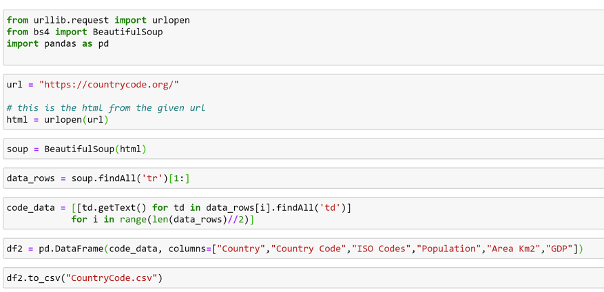
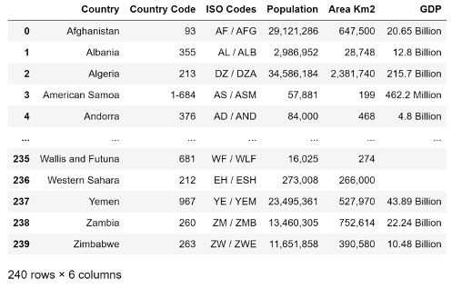

### Team Members: 

Omar Haddad, Irais Garcia, Nithin Sunil, Lolita Dias

# CO2 Emissions analysis 
Find the relationship between CO2 emissions, GDP, population, year, life expectancy and infant mortality for years
1960-2015.

## EXTRACTION

### Data Source 1: 
The data for the country codes came from the website https://countrycode.org/, where the country phone codes are displayed and are unique to each country. The method used to extract the data was web scraping using BeautifulSoup. We examined the HTML for the table in which our data was stored and we loaded it into a DataFrame using Pandas. Finally, the file was saved as a CSV file that included new headers for the columns.
Below, find the screenshot of the code written to arrive to the final file.

### Data Source 2:
Gapminder data was obtained from the Gapminder Organization’s website: gapminder.org. The Gapminder organization seeks to dispel myths about global trends such as fertility rates, mortality rates, and income inequality. The dataset contains information on every country in the world from 1960 to 2015.

### Data Source 3: 
The information used during the project was World Bank data pulled directly from its website. The data used included information about each country’s economic indicators for each year starting from 1960. These indicators included life expectancy, infant mortality, fertility, and population. In addition, we used CO2 emissions per capita data for each country from 1960.

## TRANSFORM

### Data Source 1: 
For the Country Code dataset, the only transformation happened while turning the dataset into a CSV file by changing the column names, the data looked clean and complete.

### Data Source 2
Given that the dataset spanned many years and nations, there was inevitably going to be gaps in data for some years. We handled these gaps by changing the placeholder value “NA” with “0”. We did this for numeric columns so that our importing procedure can go smoothly. It also allows us to perform calculations without running into any casting errors.

### Data Source 3
The two datasets were formatted differently. In the CO2 data, the years were listed along the x-axis, while the countries were listed on the y-axis. In addition, there was only one instance of each country listed in the dataset. In contrast, the economic indicator dataset had multiple instances of each country in order to represent each year and the years were listed along the y-axis. In order to format the data in order to merge the tables, we had to use Visual Basic to create multiple instances of each country to represent each year. This was because there were 255 countries multiplied over 55 years, which made doing this task manually impossible. Using code from Stack Overflow, we were able to resolve this issue.

# Questions - Answered

###### 1. Where is crime concentrated in Austin? 

* Downtown has the largest concentration of crime with 8075 reports.
* Crime reports in each zip code do not correlate to population density, as there are certain zip code with a low population but a high number of crime reports, or vice versa.
* There is a high intensity of crime rate per 100,000 people in Downtown and East Austin (78701, 78702, 78703), showing that most crimes occur in this area.

###### 2. Is there a correlation between housing prices and crime rate? 

* Overall, population and median home cost in Austin increased between 2011 and 2016.
* There appears to be similarities in the rate of increase for both population and median home cost.
* Overall, crime decreased across most of the Austin zip codes.
* There is no visible relationship between the crime and the median home cost.

###### 3. Which type of crime is prominent in each zip code? 

* The most common violent crime by zip code is Aggravated Assault.
* The most common non-violent crime by zip code is Theft.
* Exemplary of national statistics that not all sexual assault cases are reported, out of a population of 950,715, only 1,140 cases of Sexual Assault were reported in 2018.
* We extrapolated a few zip codes and noted that there was 254 instances theft in 78613, which is Cedar Park, a zip code spanning Williamson County with a population of over 48,000 people. Given that we have calculated a 14% correlation between population size and crime rate, it stands to reason that population density has no real effect on the amount of crime occurring in a given area. 

###### 4. Does population influence the crime rate in a zip code?

* There is a weak positive (14%) correlation between population and crime rates. 
* Zip codes that are zoned with a lot of commercial areas tend to have low populations with higher reports of crime. 

## Conclusions

Based on the data we have found: 
* There is no visible relationship between the crime and the median home cost, making it difficult to track neighborhood desirability based solely on property value changes. Despite gentrification in some areas such as  78702--with property values rising to over $200,000 in 2016--the amount of crime in that area remains roughly unchanged since 2016, with 629,616 crime reports filed in 2018.
* To avoid crime the best place to live would be away from Downtown Austin because the most crime concentration is in Downtown.
* While population and median home cost in Austin increased between 2011 and 2016 the crime rate decreased across most of the Austin zip codes.
* Population is not a good indicator of crime because many crimes are committed in commercial areas where not as many people live. 
* More investigation needed to determine what might affect the crime rate.

## Disclaimer 
This is not real safety & security advice, it is only based on the data and the results analyzed from the Austin crime data sample from 2011 - 2016.
