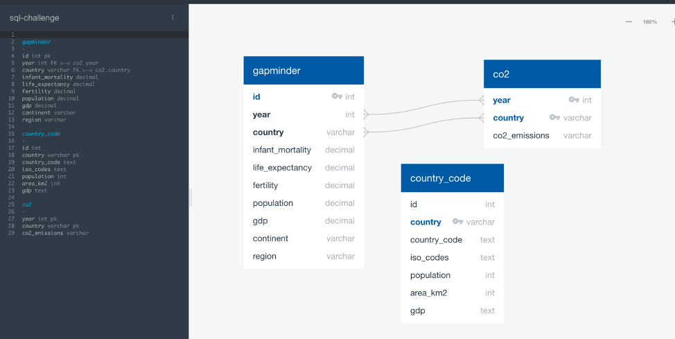
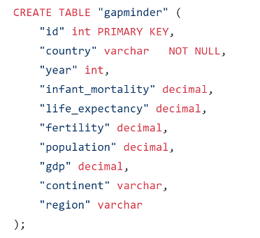
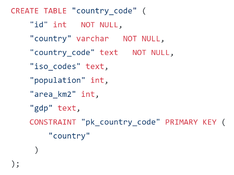
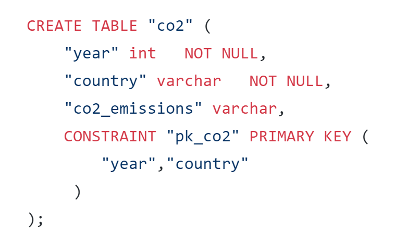

### Team Members: 

Omar Haddad, Irais Garcia, Nithin Sunil, Lolita Dias

# CO2 Emissions analysis 
Find the relationship between CO2 emissions, GDP, population, year, life expectancy and infant mortality for years
1960-2015.

## EXTRACTION

### Data Source 1: 
The data for the country codes came from the website https://countrycode.org/, where the country phone codes are displayed and are unique to each country. The method used to extract the data was web scraping using BeautifulSoup. We examined the HTML for the table in which our data was stored and we loaded it into a DataFrame using Pandas. Finally, the file was saved as a CSV file that included new headers for the columns.
Below, find the screenshot of the code written to arrive to the final file.

### Data Source 2:
Gapminder data was obtained from the Gapminder Organization’s website: gapminder.org. The Gapminder organization seeks to dispel myths about global trends such as fertility rates, mortality rates, and income inequality. The dataset contains information on every country in the world from 1960 to 2015.

### Data Source 3: 
The information used during the project was World Bank data pulled directly from its website. The data used included information about each country’s economic indicators for each year starting from 1960. These indicators included life expectancy, infant mortality, fertility, and population. In addition, we used CO2 emissions per capita data for each country from 1960.

## TRANSFORM

### Data Source 1: 
For the Country Code dataset, the only transformation happened while turning the dataset into a CSV file by changing the column names, the data looked clean and complete.

### Data Source 2
Given that the dataset spanned many years and nations, there was inevitably going to be gaps in data for some years. We handled these gaps by changing the placeholder value “NA” with “0”. We did this for numeric columns so that our importing procedure can go smoothly. It also allows us to perform calculations without running into any casting errors.

### Data Source 3
The two datasets were formatted differently. In the CO2 data, the years were listed along the x-axis, while the countries were listed on the y-axis. In addition, there was only one instance of each country listed in the dataset. In contrast, the economic indicator dataset had multiple instances of each country in order to represent each year and the years were listed along the y-axis. In order to format the data in order to merge the tables, we had to use Visual Basic to create multiple instances of each country to represent each year. This was because there were 255 countries multiplied over 55 years, which made doing this task manually impossible. Using code from Stack Overflow, we were able to resolve this issue.

## LOAD
To load the data, we used Postgress by creating tables for each of the datasets to be able to load the files into the database. We first used QuickDBD to create an ERD and better visualize how our data would come together in the end.

To display the data that we were looking for, we used join statements. Additionally, we created a new column calculating how much CO2 there was per Km2.

